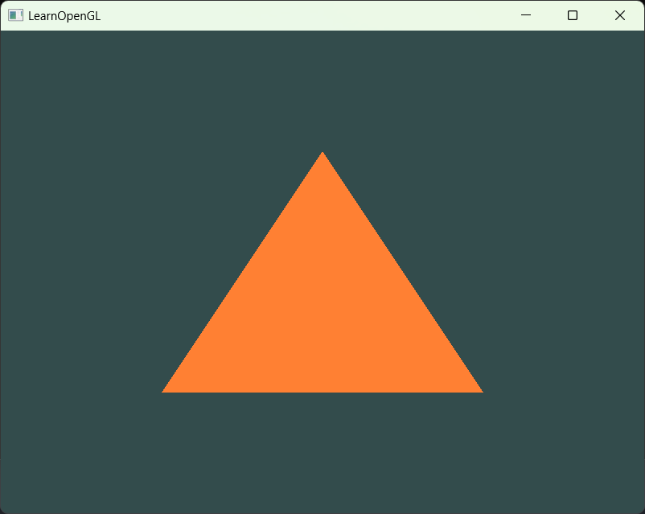
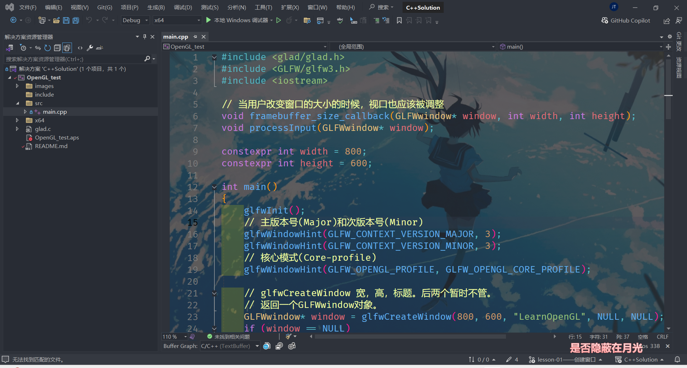

# lesson01――创建窗口
## 简介：
通过学习GLFW库的基础内容，学习GLFW的工作原理以及视口，输入，渲染等概念。

## 体验：
visual studio非常不好用，有点垃圾了，受限太大了，有很多莫名其妙的规矩，
很强大的IDE，但是没人用，没人用的强大？？？

当然，这是第一课，很可能是我没有体会到visual studio的美妙之处。

某种程度上Qt有点像这个，但是连Qt的教学都比这玩意多。

## 效果：

运行效果图：

美化效果图：
