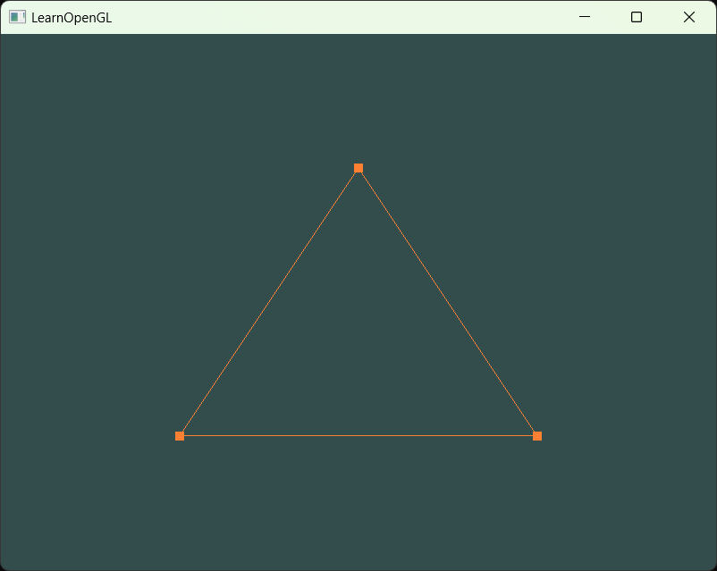

# lesson02――你好，三角
## 简介：
本次的任务很重，首先是处理项目目录，不处理根本就不能明晰整个项目了，因为到了lesson-02，
我们发现，我们要处理的已经不仅仅是课程教学目标了，还有额外的任务与自我实践，源码也很复杂很复杂了，不存储也不行了。

这就需要我们做出很多改变：
1. 修改项目目录。
1. 理清各部分脉络思路，写好介绍的README.md。
1. 熟悉visual studio编写项目的方法。

visual studio是一个没人喜欢的编译器，但是你不得不承认，它在很多地方确实好用，我现在可以是稍微对visual studio有了一丝的改观，
但这些改观是它应该做到的，而不是各种标新立异，非要把Git单独弄出来搞一个莫名其妙的东西，非要搞出很多莫名其妙的特殊键。

## 目录
从lesson-02开始我们记录源码和目录的详细说明。

标准：其余课程简略，当前课程详细。

所追求的示例目录：
```.cpp
C++_Project/
├── build/                  # 构建文件夹，包含编译后的文件
├── docs/                   # 文档目录，包含项目文档
│   ├── design.md           # 设计文档
│   └── user_manual.md      # 用户手册
├── include/                # 头文件目录
│   ├── module1.h           # 模块1头文件
│   └── module2.h           # 模块2头文件
├── src/                    # 源代码目录
│   ├── main.cpp            # 主程序入口
│   ├── module1.cpp         # 模块1的源文件
│   ├── module2.cpp         # 模块2的源文件
│   └── utils/              # 辅助工具目录
│       └── helper.cpp      # 辅助功能的实现
├── tests/                  # 单元测试代码
│   ├── test_module1.cpp    # 模块1的测试代码
│   └── test_module2.cpp    # 模块2的测试代码
├── third_party/            # 第三方库目录
│   └── README.md           # 说明第三方库的使用
├── CMakeLists.txt          # CMake 构建脚本
├── Makefile                # Makefile 构建脚本（如果不使用 CMake）
└── README.md               # 项目介绍

```

lesson-02目录：
```
OpenGL_test/
├──source/
│   ├──origin/
│   │    ├──lesson-01.cpp
│   │    ├──lesson-02-1.cpp
│   │    └──lesson-02-2.cpp
│   │	   
│   └──basics/
│        └──01-1绘制三角.cpp
├──src/
│   └──main.cpp
│
├──images/
│ 
└──README.md
```

## lesson-02详细目录介绍

origin下的文件都是源网站的源代码，用于查看的。

basics是我们的尝试以及实践。

### 02-1 绘制三角.cpp

效果图：


流程：

1. 在我们lesson-01的基础上，加上着色器的使用并将其链接起来。

2. 处理顶点的输入，利用顶点缓冲对象VBO，顶点数组对象VAO

3. 成功渲染。

### 02-2 绘制三角点和线

1. 修改函数，使用glad的增强功能`glEnable(GL_PROGRAM_POINT_SIZE);` or 设置函数`glPointSize(10.0f)`;
1. 记得要把点的大小设大，不然看不见。

